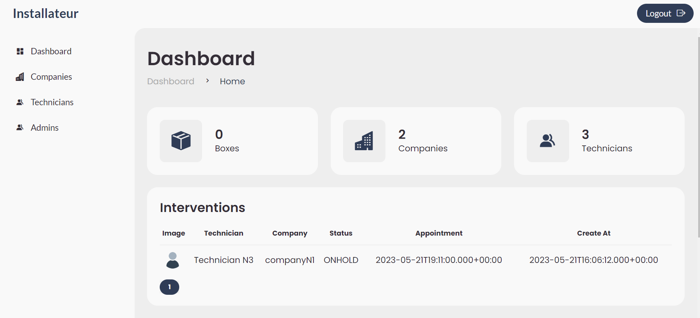
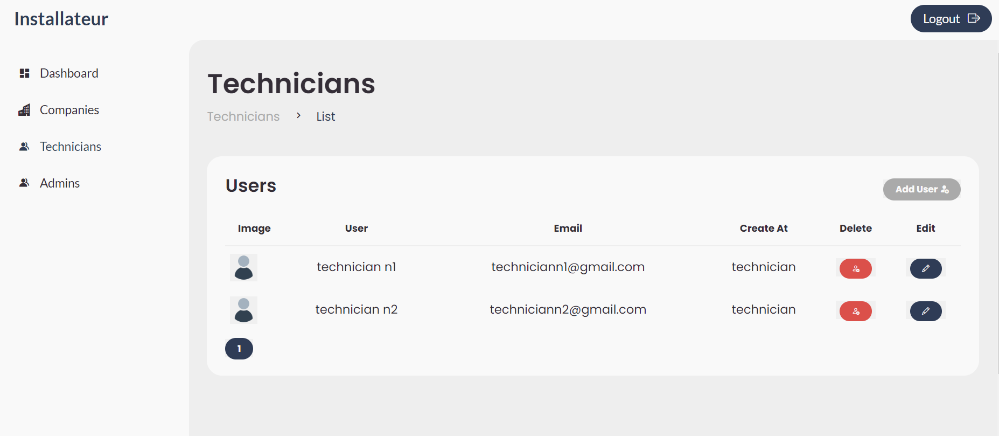
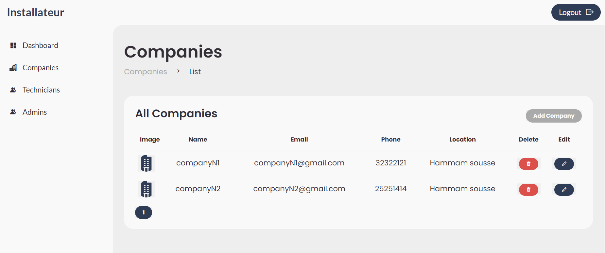
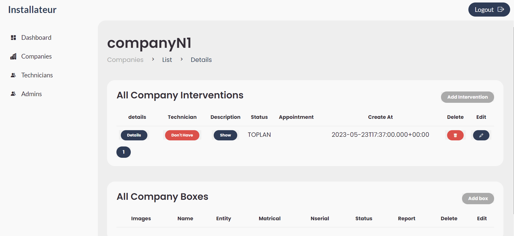
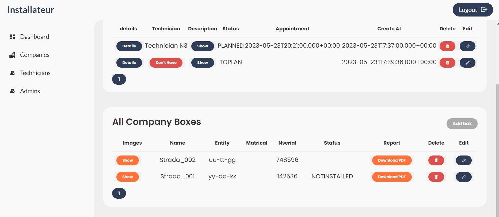

# InstallateurAdmin Dashboard Web App

Welcome to the InstallateurAdmin Dashboard web application repository!

## Overview

InstallateurAdmin Dashboard is a web application designed to provide administrators with tools to oversee installation interventions for auto boxes. It offers features for managing users, companies, interventions, boxes and calendars efficiently.

## Screenshots
Dashboard

The user management UI of the administrator application where he can directly create a new
user, update a user or delete user.

The company management UI of the administrator application where he can directly create a
new company, update a company or delete company. 

The figure below, display the company details UI where the administrator can manage the
company’s interventions and boxes.

The Box management UI of the administrator application where he can directly create a new
user, update a user or delete user.


## Development Server

To run the development server, execute the following command:

```sh
ng serve
```

Navigate to `http://localhost:4200/` to access the application. The app will automatically reload if you make any changes to the source files.

## Build

To build the project, execute:

```sh
ng build
```

The build artifacts will be stored in the `dist/` directory.


## Further Help

For more help on using Angular CLI, run:

```sh
ng help
```

You can also refer to the [Angular CLI Overview and Command Reference](https://angular.io/cli) page.


## License

This project is licensed under the MIT License. See the [LICENSE](LICENSE) file for details.
## My Links
[](https://www.facebook.com/habib.sidiahmed.5)   [](https://www.linkedin.com/in/sidi-ahmed-habib-18163220a/)
